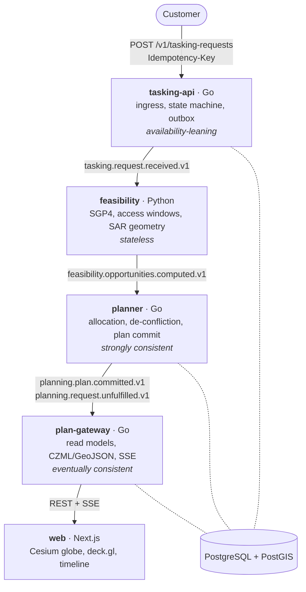

# Overpass

Satellite tasking, feasibility, and collection planning for a simulated
constellation of SAR satellites.

[](https://github.com/mhayk/Overpass/actions/workflows/ci.yml)
[](https://github.com/mhayk/Overpass/actions/workflows/contracts.yml)
[](https://github.com/mhayk/Overpass/actions/workflows/stack.yml)

A customer asks for radar imagery of a point or polygon, with a deadline and a
bid. Overpass accepts that request without blocking, works out when — if ever —
each satellite can actually image the target using real orbital propagation and
real SAR acquisition geometry, and then resolves the competition between
customers who want overlapping windows on the same satellite into a
conflict-free collection plan.

**Built from public sources only.** Public TLEs from Celestrak, published SAR
geometry concepts from open literature. No proprietary data and no internal
knowledge from any employer.

---

## The problem worth reading the code for

Feasibility is the domain flavour. Allocation is the engineering problem.

Once you know which satellite can image which target in which window, you have
to choose. At most one acquisition per request. No two acquisitions on the same
satellite may overlap. Between consecutive acquisitions the satellite has to
*roll*, so the gap between them must be at least `slew_time(a, b)` — which makes
this scheduling with **sequence-dependent setup times on parallel machines**, not
interval scheduling. Add a per-orbit duty-cycle budget and it grows a knapsack
dimension too. It is NP-hard.

So the algorithm is not asserted, it is measured. `AllocationPolicy` is an
interface with four implementations behind it, benchmarked against each other on
generated scenarios with `ExactDP` as a **proven** optimum:

| Policy | Worst-class optimality | Runtime, 5 000 candidates |
| --- | --- | --- |
| `GREEDY_BY_BID` | 85.7% | 36.7 ms |
| `GREEDY_BY_VALUE_DENSITY` | **98.0%** | 55.9 ms |
| `VICKREY_SEALED_BID` | 85.7% | 130.7 ms |
| `EXACT_DP` (reference) | 100% | refuses instances this size, loudly |

Value density reaches 98% of a proven optimum in microseconds where the exact
solver needs up to 3.34 s on eleven candidates — and its worst case is a
*contended* scenario, which is the only kind that matters. Full tables, scenario
classes, and where each heuristic is worst: [`docs/policy-benchmark.md`](docs/policy-benchmark.md).
The reasoning behind measuring rather than choosing: [ADR-0007](docs/decisions/0007-allocation-strategy.md).

---

## Quick start

Requires Docker, and [`uv`](https://docs.astral.sh/uv/) for the seed and demo
scripts.

```bash
cp .env.example .env
make up-all     # infrastructure + application services, migrations included
make seed       # constellation, customers, live TLEs from Celestrak
make demo       # submits a deliberately contested set of requests
```

Then open <http://localhost:3000> and watch the plan change.

| | |
| --- | --- |
| Web | <http://localhost:3000> |
| tasking-api | <http://localhost:8080> |
| plan-gateway | <http://localhost:8083> |
| Grafana | <http://localhost:3001> (anonymous, no login) |
| Prometheus | <http://localhost:9090> |
| NATS monitor | <http://localhost:8222> |
| Postgres | `postgres://overpass@localhost:5433/overpass` |

`make up` brings up infrastructure only. `make help` lists everything else.

Cold start is a gate rather than a claim — `scripts/stack-up.sh` exits non-zero
when it overruns. On a two-core GitHub runner: **112 s** for infrastructure,
**190 s** more for four cold image builds.

---

## Architecture



Solid arrows are NATS JetStream subjects, at-least-once, so every handler is
idempotent. Dashed lines are SQL against the one Postgres, schema per service.
Full C4 diagrams and the event-flow sequence:
[`docs/architecture/`](docs/architecture/).

**The boundaries are consistency boundaries, not nouns.** `tasking-api` must
never drop a request and never block on computation. `feasibility` is a pure
function and horizontally scalable. `planner` is the one strongly-consistent
component, because two customers cannot both win the same window. `plan-gateway`
is eventually consistent by design and caches freely. Four services, four
deliberate positions on the CAP tradeoff — [ADR-0003](docs/decisions/0003-consistency-boundaries-and-cap-position.md).

The Go/Python line falls *on* an existing boundary rather than adding one.
Python is there for the orbital-mechanics ecosystem — sgp4, Skyfield, pyproj,
Shapely — because reimplementing SGP4 in Go to keep the repo monoglot would be a
worse decision than paying for two toolchains: [ADR-0001](docs/decisions/0001-polyglot-go-python-split.md).

---

## Where the invariants live

The recurring answer is *not in application code*.

- **Non-overlap** is a `tstzrange` + GiST exclusion constraint on `acquisitions`,
  partial and deferred so a plan can replace the one it supersedes inside a
  single transaction ([ADR-0012](docs/decisions/0012-retain-superseded-acquisitions.md)).
  The database refuses an overlapping plan; the planner does not merely try not
  to write one.
- **Single-writer allocation** is `pg_advisory_xact_lock` per
  `(satellite_id, horizon_bucket)`. Transaction-scoped, so Postgres releases it
  when the connection dies — no lease to tune, no expiry to forget. Different
  satellites plan in parallel; that is where the concurrency lives.
- **Effectively-once processing** on top of at-least-once delivery: the
  `event_id` insert into `processed_events` commits in the same transaction as
  the state change. A duplicate hits the unique constraint, the transaction rolls
  back, the message is acked ([ADR-0008](docs/decisions/0008-idempotency.md)).
- **No dual writes.** Nothing publishes inside a business transaction. The row
  and its outbox entry commit together and a relay publishes afterwards
  ([ADR-0006](docs/decisions/0006-transactional-outbox.md)).
- **Contracts are the source of truth.** JSON Schema events and OpenAPI live in
  [`contracts/`](contracts/), generate into Go and Python, and the generated code
  is committed with `make contracts-verify` as a drift gate in CI.

---

## Numbers

Measured on a stated machine, because an SLO without an environment is a number
without meaning. Full write-up, graphs and failure modes:
[`docs/performance.md`](docs/performance.md).

| | Target | Measured |
| --- | --- | --- |
| Ingress p95 @ 1 000 rps | < 40 ms | **9.79 ms** |
| Ingress p99 @ 1 000 rps | < 120 ms | **18.26 ms** |
| Ingress errors | zero | **0 / 33 302** |

The ingress latency curve is flat from 10 to 1 000 rps — the median does not
degrade at all, only the tail doubles. That is ADR-0003 working, measured rather
than argued.

The pipeline is the opposite story and the document says so: end-to-end
submit-to-visible sits around 30 s, because a single feasibility worker is the
whole pipeline's throughput ceiling. Ingress outruns it by roughly 4000:1. That
is a known, filed, un-hidden bottleneck ([#189](https://github.com/mhayk/Overpass/issues/189)),
not a number left out of the table.

Eleven documented failure modes — planner `SIGKILL` mid-round, relay restart
mid-publish, broker restart under load, duplicates injected at every hop at
once — each with the mechanism that holds it and the integration test that kills
the process to prove it.

---

## Testing

The test suite is the verification harness for generated code, which is why it
is shaped the way it is ([ADR-0010](docs/decisions/0010-test-strategy-and-coverage.md)).

- **Property-based** on the scheduler. For *any* generated input the plan must
  contain no overlap and no slew violation. Invariants beat examples where
  correctness is hardest.
- **Golden-reference** for orbital math, against known passes for a public
  satellite at a frozen TLE and epoch. Physics needs an oracle, not a snapshot of
  the generator's own output.
- **Integration** against real Postgres and real NATS via Testcontainers —
  duplicate delivery, out-of-order delivery, consumer killed mid-transaction,
  outbox relay restarted.
- **Contract tests** validating every emitted event against its schema.
- **Coverage gate**: 80% overall, 95% on planner and geometry. Not 100%, which
  would be theatre.

```bash
make test              # every unit suite
make test-integration  # real Postgres, real NATS
make coverage          # the 80/95 gate
make lint              # golangci-lint, ruff + mypy strict, eslint + tsc
```

---

## Layout

```
services/tasking-api   Go  REST ingress, outbox, request state machine
services/feasibility   Py  SGP4, access windows, SAR geometry
services/planner       Go  allocation, de-confliction, plan commit
services/plan-gateway  Go  read models, CZML/GeoJSON, SSE
services/simulator     Py  acquisition execution, TLE drift, failure injection
web                    TS  Next.js, Cesium, deck.gl
contracts              --  JSON Schema events + OpenAPI (source of truth)
gen                    --  generated types, committed, drift-gated
db/migrations          --  one Postgres, schema per service
deploy                 --  compose config: nats, postgres, tempo, otel, grafana
loadtest               --  k6 scenarios, thresholds as gates
testdata               --  frozen TLEs for golden tests, benchmark scenarios
docs/decisions         --  21 ADRs
```

---

## Deliberate scope cuts

These are choices, not oversights.

- **No auth and no multi-tenancy.** `customer_id` is a stub. Adding OIDC would
  demonstrate nothing this project does not already demonstrate, and would cost
  time the allocation problem deserves.
- **No real uplink, no SAR image formation, no downlink.** The physics that is
  modelled — propagation, access geometry, slew, duty cycle — is the physics the
  scheduling problem depends on. The rest is out.
- **No Kubernetes.** Docker Compose is the deployment target, argued in
  [ADR-0005](docs/decisions/0005-docker-compose-over-kubernetes.md).
- **Acquisition execution is simulated**, and computes drift rather than rolling
  for it, so the same scenario is reproducible
  ([ADR-0021](docs/decisions/0021-the-execution-simulator-computes-drift-rather-than-rolling-for-it.md)).
- **Feasibility runs as a single worker.** It is the pipeline's throughput
  ceiling and it is filed rather than fixed, because the fix is horizontal
  scaling that would demonstrate nothing new.

---

## Documentation

| | |
| --- | --- |
| [`docs/SPEC.md`](docs/SPEC.md) | What is being built, and the domain primer |
| [`docs/decisions/`](docs/decisions/) | 21 ADRs, each naming the alternatives that lost |
| [`docs/architecture/`](docs/architecture/) | C4 context and container diagrams, event flow |
| [`docs/performance.md`](docs/performance.md) | Numbers, graphs, and eleven failure modes |
| [`docs/policy-benchmark.md`](docs/policy-benchmark.md) | Four allocation policies, measured |
| [`docs/ai-engineering/`](docs/ai-engineering/) | How this repo was built with agents, and what failed |
| [`docs/runbooks/`](docs/runbooks/) | DLQ replay, timeout audit |
| [`docs/backlog.md`](docs/backlog.md) | Milestones M0–M5 and their sequencing rationale |
| [`CONTRIBUTING.md`](CONTRIBUTING.md) | Branching, commits, and the gates a PR must pass |

Every ADR carries a **Confirmation** section stating what would prove it wrong.
A decision nothing could falsify is a preference wearing a decision's clothes.
