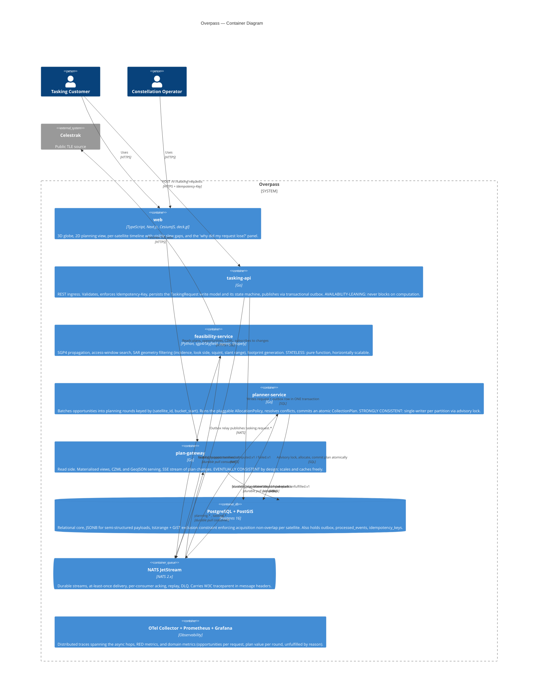
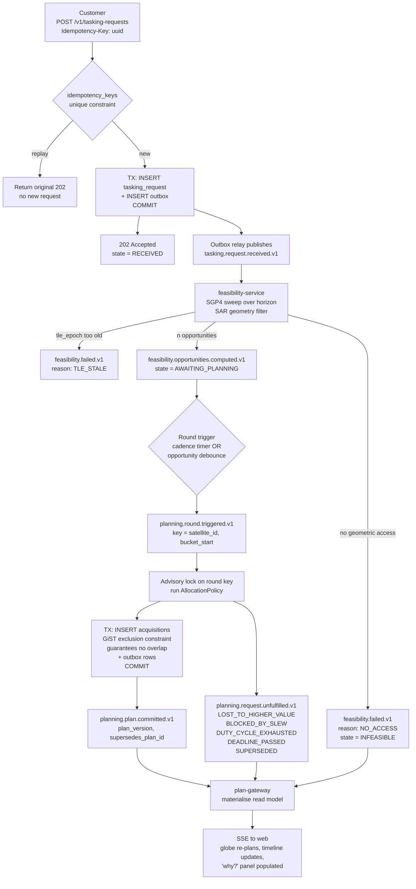

# C4 Level 2 — Containers

The inside of the Overpass box. Every boundary here is a consistency boundary —
see [ADR-0003](../decisions/0003-consistency-boundaries-and-cap-position.md) for
why, and for each service's position on the CAP tradeoff.

## Event flow — the happy path, and where it can stop

The C4 diagram shows structure; this shows sequence. Note that every arrow into a
service is at-least-once, so every handler is idempotent.

The failure branches are drawn deliberately. `planning.request.unfulfilled.v1`
carrying a specific reason code is what makes the "why was my request rejected?"
panel possible, and that panel is the UI equivalent of an ADR: the system
explains its decisions rather than merely announcing them.

## Why these four services and not one, or seven

Each boundary earns its place by having a *different* consistency or availability
requirement on each side. If two of these services had the same posture and the
same data ownership, they would be one service.

| Boundary | What differs across it |
| --- | --- |
| `tasking-api` ↔ `feasibility-service` | Availability-leaning ingress must not block on an expensive, unbounded computation. This is also where the async latency curve stays flat while the sync path would degrade. |
| `feasibility-service` ↔ `planner-service` | Stateless, embarrassingly parallel compute versus serialised, transactional allocation. Opposite scaling models. |
| `planner-service` ↔ `plan-gateway` | Strong consistency and single-writer versus eventual consistency and free horizontal read scaling. CQRS-lite: the write model and the read model have different owners. |
| Go ↔ Python | Ecosystem fit ([ADR-0001](../decisions/0001-polyglot-go-python-split.md)). Note this line falls *on* an existing consistency boundary rather than adding a new seam. |

## Cross-cutting mechanisms

| Mechanism | Where it lives | What it buys |
| --- | --- | --- |
| Transactional outbox | `tasking-api`, `planner-service` | Removes the dual-write problem: a state change and its event are one transaction, or neither happened |
| Idempotent consumer | every consumer | `processed_events` insert in the same transaction as the state change turns at-least-once *delivery* into effectively-once *processing* |
| Advisory lock per `(satellite_id, bucket_start)` | `planner-service` | Single-writer per partition; the constellation still plans in parallel because the lock granularity matches the invariant granularity |
| GiST exclusion constraint | PostgreSQL | The non-overlap invariant is unbypassable, including by future code paths and manual SQL |
| W3C traceparent in NATS headers | all | One trace survives HTTP ingress → publish → Python consumer → publish → Go planner → commit |
| DLQ + max-deliver | NATS JetStream | Poison messages stop retrying and become a documented, replayable operational task |

## Deployment view

All nine containers come up under a single `docker compose up`
([ADR-0005](../decisions/0005-docker-compose-over-kubernetes.md)). Services are
twelve-factor — configuration from environment, logs to stdout, no local state —
so moving to a real scheduler later is a packaging change, not a code change.
