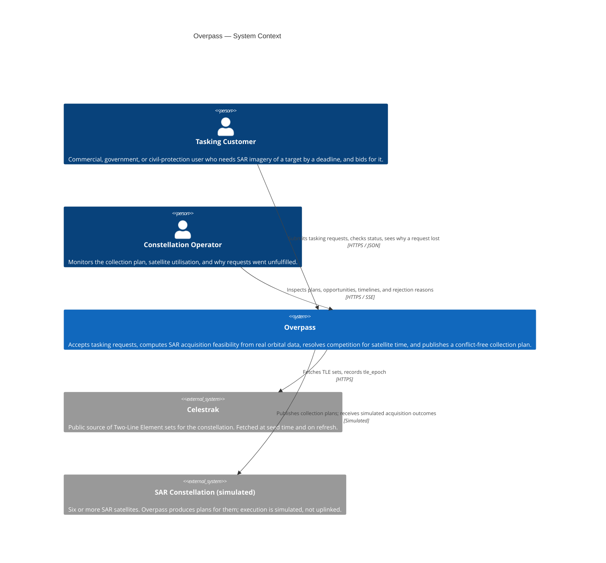

# C4 Level 1 — System context

Who uses Overpass, and what it depends on. One box for the whole system; the
interesting content is at the edges.

## Actors

| Actor | What they want | What Overpass owes them |
| --- | --- | --- |
| **Tasking Customer** | Imagery of a point or polygon, before a deadline, at a price they choose | Fast acknowledgement under load, an honest feasibility answer, and — when they lose — a specific reason, not a shrug |
| **Constellation Operator** | Confidence the plan is flyable and the constellation is well used | A plan that provably contains no overlapping or unslewable acquisitions, plus utilisation and value metrics per round |

## External dependencies

**Celestrak** is the only true external dependency, and it is a soft one.
TLEs are fetched live at seed time so that TLE staleness (`tle_epoch` age) is
exercised for real rather than simulated. A cached snapshot ships in the repo so
that `docker compose up` works with no network, and a separate frozen snapshot in
`testdata/tle/` is what golden-reference orbital tests run against — those must
be deterministic. See ADR-0011 (planned).

**The constellation itself is simulated.** There is no command uplink, no SAR
image formation, and no downlink. `acquisition.executed.v1` is generated by a
simulator in M4. This is a deliberate scope cut, stated in the README rather than
discovered by the reader.

## Deliberate scope cuts at this boundary

- **No authentication or multi-tenancy.** `customer_id` is a stub carried on the
  request. Real tenancy would change the fairness model
  (per-tenant quotas), the read model (row-level filtering), and the API surface.
  Cut on purpose, not overlooked.
- **No billing.** Bids are integer credits with no settlement. The Vickrey
  second-price policy computes a clearing price; nothing charges it.
- **No ground-station or downlink scheduling.** Acquisition is where the model
  stops. Downlink contention is a second, structurally similar scheduling problem
  and doubling the scope would halve the depth.
