# Policy benchmark

Four allocation policies over identical generated scenarios, seeded with 20260809 so
the numbers are reproducible — bar the runtimes, which belong to whatever
machine ran `make benchmark`. Regenerate with:

    make benchmark

Every optimality ratio is against a PROVEN optimum from ExactDP; instances the
exact solver could not finish carry no ratio, and the solved count per class
says how many that was rather than quietly excluding them. 12 instances per
class, 11 candidates each — inside the exact solver's limit deliberately.

## Optimality ratio by scenario class

How much of the optimal plan value each heuristic captured, averaged per class.

```mermaid
xychart-beta
    title "Mean optimality ratio (% of ExactDP)"
    x-axis ["C1", "C2", "C3", "C4", "C5", "C6", "C7", "C8"]
    y-axis "ratio %" 0 --> 100
    bar [92.8, 85.7, 95.6, 96.7, 99.2, 99.3, 99.6, 100.0]
    bar [98.6, 98.8, 98.0, 98.4, 98.2, 99.0, 99.6, 100.0]
    bar [92.8, 85.7, 95.6, 96.7, 99.2, 99.3, 99.6, 100.0]
```

Series order: GREEDY_BY_BID, GREEDY_BY_VALUE_DENSITY, VICKREY_SEALED_BID.

Class key:

- **C1** — contended/loose-deadlines/clustered
- **C2** — contended/loose-deadlines/dispersed
- **C3** — contended/tight-deadlines/clustered
- **C4** — contended/tight-deadlines/dispersed
- **C5** — uncontended/loose-deadlines/clustered
- **C6** — uncontended/loose-deadlines/dispersed
- **C7** — uncontended/tight-deadlines/clustered
- **C8** — uncontended/tight-deadlines/dispersed

## Full results

### contended/loose-deadlines/clustered

12 of 12 instances solved to proven optimality.

| policy | optimality | plan value | fulfilled | utilisation | runtime |
| --- | --- | --- | --- | --- | --- |
| EXACT_DP (reference) | 100% | 2704 | 39% | 95% | 60.9ms |
| GREEDY_BY_BID | 92.8% | 2512 | 31% | 95% | 13µs |
| GREEDY_BY_VALUE_DENSITY | 98.6% | 2667 | 39% | 92% | 12µs |
| VICKREY_SEALED_BID | 92.8% | 2512 | 31% | 95% | 20µs |

### contended/loose-deadlines/dispersed

12 of 12 instances solved to proven optimality.

| policy | optimality | plan value | fulfilled | utilisation | runtime |
| --- | --- | --- | --- | --- | --- |
| EXACT_DP (reference) | 100% | 3037 | 41% | 93% | 50.4ms |
| GREEDY_BY_BID | 85.7% | 2612 | 30% | 91% | 21µs |
| GREEDY_BY_VALUE_DENSITY | 98.8% | 3005 | 41% | 91% | 14µs |
| VICKREY_SEALED_BID | 85.7% | 2612 | 30% | 91% | 31µs |

### contended/tight-deadlines/clustered

12 of 12 instances solved to proven optimality.

| policy | optimality | plan value | fulfilled | utilisation | runtime |
| --- | --- | --- | --- | --- | --- |
| EXACT_DP (reference) | 100% | 3012 | 37% | 94% | 37.8ms |
| GREEDY_BY_BID | 95.6% | 2873 | 33% | 96% | 12µs |
| GREEDY_BY_VALUE_DENSITY | 98.0% | 2955 | 37% | 90% | 12µs |
| VICKREY_SEALED_BID | 95.6% | 2873 | 33% | 96% | 20µs |

### contended/tight-deadlines/dispersed

12 of 12 instances solved to proven optimality.

| policy | optimality | plan value | fulfilled | utilisation | runtime |
| --- | --- | --- | --- | --- | --- |
| EXACT_DP (reference) | 100% | 2874 | 37% | 92% | 39.5ms |
| GREEDY_BY_BID | 96.7% | 2782 | 33% | 94% | 19µs |
| GREEDY_BY_VALUE_DENSITY | 98.4% | 2834 | 38% | 90% | 15µs |
| VICKREY_SEALED_BID | 96.7% | 2782 | 33% | 94% | 30µs |

### uncontended/loose-deadlines/clustered

12 of 12 instances solved to proven optimality.

| policy | optimality | plan value | fulfilled | utilisation | runtime |
| --- | --- | --- | --- | --- | --- |
| EXACT_DP (reference) | 100% | 5470 | 100% | 50% | 145.5ms |
| GREEDY_BY_BID | 99.2% | 5433 | 98% | 49% | 31µs |
| GREEDY_BY_VALUE_DENSITY | 98.2% | 5374 | 98% | 49% | 14µs |
| VICKREY_SEALED_BID | 99.2% | 5433 | 98% | 49% | 37µs |

### uncontended/loose-deadlines/dispersed

10 of 12 instances solved to proven optimality.

| policy | optimality | plan value | fulfilled | utilisation | runtime |
| --- | --- | --- | --- | --- | --- |
| EXACT_DP (reference) | 100% | 5404 | 98% | 49% | 834.3ms |
| GREEDY_BY_BID | 99.3% | 5367 | 97% | 49% | 13µs |
| GREEDY_BY_VALUE_DENSITY | 99.0% | 5424 | 98% | 48% | 13µs |
| VICKREY_SEALED_BID | 99.3% | 5367 | 97% | 49% | 44µs |

### uncontended/tight-deadlines/clustered

8 of 12 instances solved to proven optimality.

| policy | optimality | plan value | fulfilled | utilisation | runtime |
| --- | --- | --- | --- | --- | --- |
| EXACT_DP (reference) | 100% | 5299 | 97% | 48% | 1.67s |
| GREEDY_BY_BID | 99.6% | 5236 | 95% | 47% | 18µs |
| GREEDY_BY_VALUE_DENSITY | 99.6% | 5283 | 96% | 47% | 23µs |
| VICKREY_SEALED_BID | 99.6% | 5236 | 95% | 47% | 45µs |

### uncontended/tight-deadlines/dispersed

4 of 12 instances solved to proven optimality.

| policy | optimality | plan value | fulfilled | utilisation | runtime |
| --- | --- | --- | --- | --- | --- |
| EXACT_DP (reference) | 100% | 5454 | 93% | 47% | 3.34s |
| GREEDY_BY_BID | 100.0% | 5257 | 90% | 45% | 17µs |
| GREEDY_BY_VALUE_DENSITY | 100.0% | 5090 | 89% | 43% | 15µs |
| VICKREY_SEALED_BID | 100.0% | 5257 | 90% | 45% | 57µs |

## Where each heuristic is worst

| policy | worst class | ratio there |
| --- | --- | --- |
| GREEDY_BY_BID | contended/loose-deadlines/dispersed | 85.7% |
| GREEDY_BY_VALUE_DENSITY | contended/tight-deadlines/clustered | 98.0% |
| VICKREY_SEALED_BID | contended/loose-deadlines/dispersed | 85.7% |

## Runtime scaling

Heuristics only — the exact solver refuses instances this size, loudly, which
is its job. One contended instance per size; the round's p95 budget is 800 ms.

| candidates | GREEDY_BY_BID | GREEDY_BY_VALUE_DENSITY | VICKREY_SEALED_BID |
| --- | --- | --- | --- |
| 100 | 187µs | 633µs | 2.5ms |
| 1000 | 6.5ms | 8.6ms | 96.8ms |
| 5000 | 36.7ms | 55.9ms | 130.7ms |

Plan value at 5000 candidates: GREEDY_BY_BID 105492, GREEDY_BY_VALUE_DENSITY 141373, VICKREY_SEALED_BID 105492.
